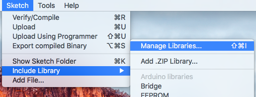
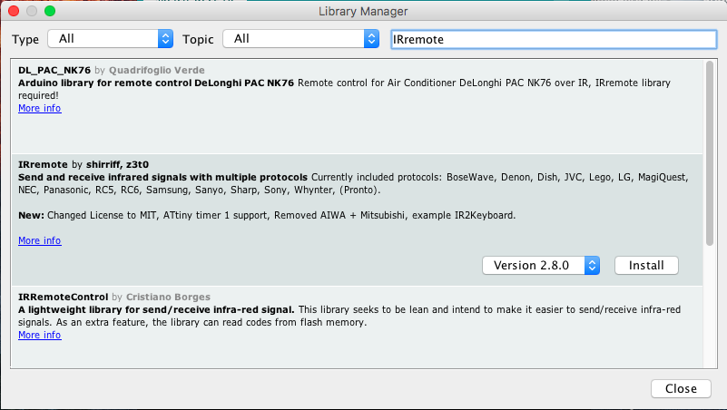

# Arduino Experimental Kit - Laser turrent

This is the source code for an arduino experimental kit for building a target finding laser turrent using:
 * Arduino Leonardo
 * 5v laser module
 * [IR receiver](https://www.electrokit.com/produkt/tsop4838-ir-modul-38-khz/)
 * [Servo motor](https://www.kjell.com/se/produkter/el-verktyg/arduino/tillbehor/luxorparts-sg90-micro-servo-1-pack-p87897)

For more information, see https://www.arduino.cc/reference/en/

## Setting up tools
Start by downloading and installing the Arduino IDE from here: https://www.arduino.cc/en/Main/Software

* Open the IDE
* Select `Manage libraries` from the menu
  
* Search for `IRremote` and click on Install
  
* Select the the example program Blink from `File > Examples > 01. Basics > Blink`
* Connect your Arduino
* Go to the menu `Tools > Boards` and select `Arduino Leonardo`
* Go to the menu `Tools > Port` and select the port for your Arduino
* Click on the button Upload and the program should be installed on your Arduino

## Installing the programs
When you verified that you can upload a program to the Arduino, continue by running these programs:

* **1_Laser** - A simple program showing how to turn on and off the laser
* **2_ServoSweep** - A program showing how to control the servo motor
* **3_IR** - A program to read from a remote control
* **4_RandomServos** - A program moving the servos randomly
* **5_Turrent** - A program to control two servos using a remote control

